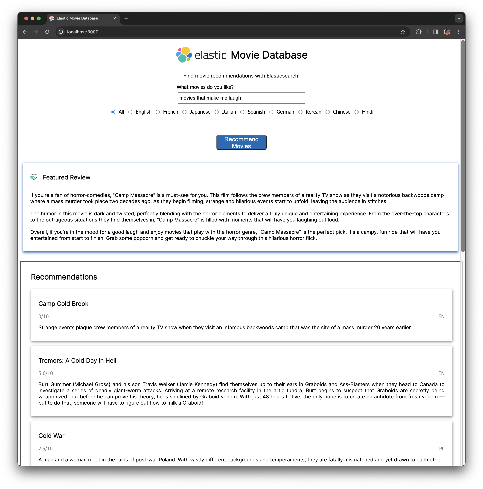

# Elasticsearch Web Search Experiences

This repo contains the content and solution for the workshop [Building Search Experiences on the Web with Elasticsearch](https://codebar.io/events/building-search-experiences-on-the-web-with-elasticsearch), run as part of [codebar Festival 2024](https://festival.codebar.io/). 

## Goal

Together we shall build a simple web application making use of simple text search, and then extend it to use vector search and generate a synopsis for recommended movies:


The final architecture consists of a UI written in JavaScript, HTML and CSS communicating with a simple Express.js server that interacts with Elasticsearch. 

There is also an extension to add response generation using an OpenAI LLM:



## How to run

To get started with the exercise, please ensure you complete the prerequisites outlined in [lab 0](./lab-sheets/0-prerequisites). The skeleton application can be run using the below commands:

```bash
cd starting-app
npm install
npm run start
```

If you struggle and prefer to run the finished applications, check out the [`simple-text-search`](./solution-app/simple-text-search/) implementation for [lab 3](./lab-sheets/3-initial-web-app) and the final hybrid solution in [`hybrid-search`](./solution-app/hybrid-search/) produced by [lab 6](./lab-sheets/6-langchain-integration) using the same `npm` commands in their respective folders.