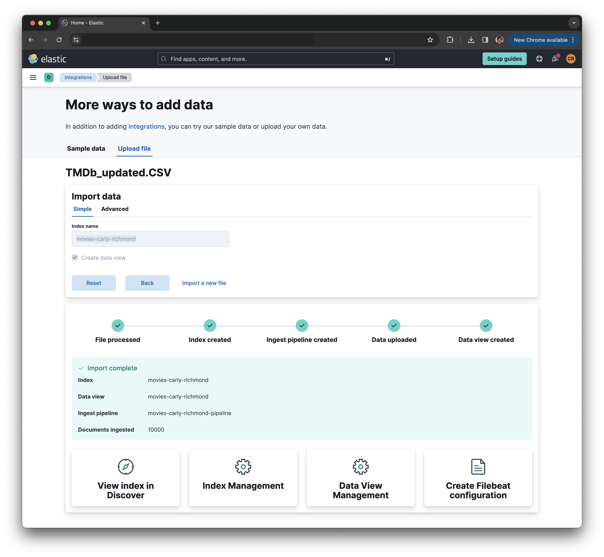

# Lab 1: Data Ingestion

In this section we are going to populate our Elasticsearch cluster with data. There are many different ways to ingest data into an Elasticsearch cluster:

1. [Elastic Beats](https://www.elastic.co/beats)
2. [Logstash](https://www.elastic.co/logstash)
3. [Elastic Agent](https://www.elastic.co/elastic-agent)
4. [Language clients](https://www.elastic.co/guide/en/elasticsearch/client/index.html) (such as the [Node.js client bulk index example](https://www.elastic.co/guide/en/elasticsearch/client/javascript-api/current/bulk_examples.html))

For ease, in this workshop we shall use the CSV upload capabilities in Kibana to create and populate our index. An inverted index is a data structure, much like the index of a book, where key terms are stored alongside a reference to the document in which they reside:

## Steps

### Data Source

We shall be using the [Popular Movies of IMDb dataset available in Kaggle](https://www.kaggle.com/datasets/sankha1998/tmdb-top-10000-popular-movies-dataset). If you have an existing Kaggle account feel free to download the CSV from the dataset page:

https://www.kaggle.com/datasets/sankha1998/tmdb-top-10000-popular-movies-dataset

Alternatively, please use the [provided CSV in the `data` folder](../data/TMDb_updated.CSV)

### Document Ingestion

1. Go into your Elastic cluster.
2. From the setup guides, select the option to explore on your own to get to the main home screen.
3. Select the *Upload a file* option under the *Get started by adding integrations* section.
4. Select the dataset CSV file using the select control.
5. Change the *column1* field name to *id*:
    * Select *Override settings* option
    * Change the name of the column1 field to *id* under *Edit field names*
    * Select *Apply*
6. Click *Import*
7. Specify the index name as `movies-<your-first-name>-<your-last-name>`. For example, the facilitator's index is named `movies-carly-richmond`.
8. click Import and verify the process completes successfully.

## Expected Result

If all goes well you should see that the import is successful and the index, ingest pipeline and data view have been successfully created:

Please contact the facilitator if you see any failure messages.