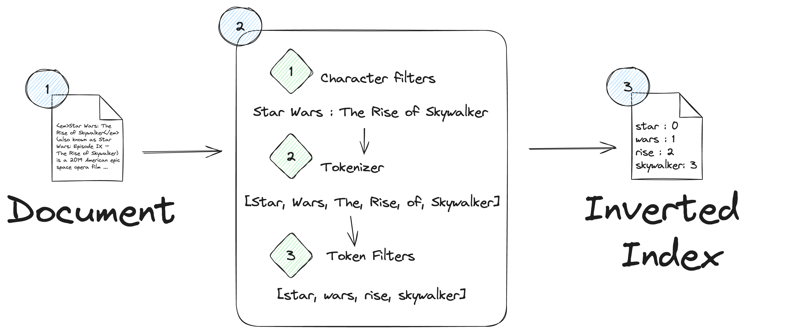
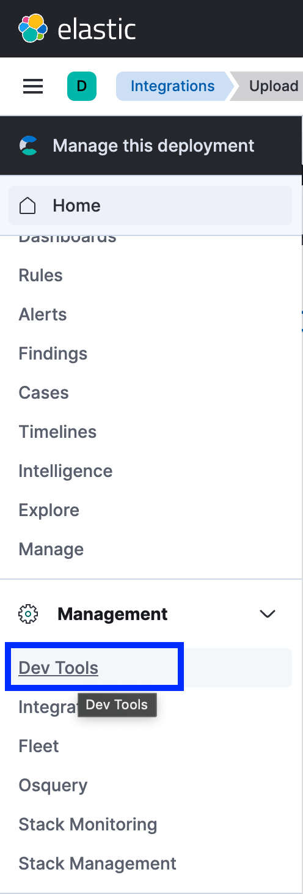
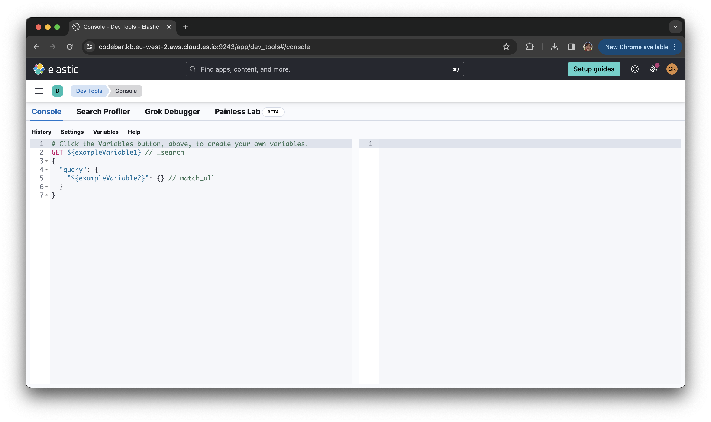

# Lab 2: Text Search

In lab 2 we shall perform some simple queries and aggregations to investigate the data we ingested in [lab 1](./1-data-ingestion). 

## What is Lexical Search?

[Lexical search, or text search](https://www.elastic.co/search-labs/blog/articles/lexical-and-semantic-search-with-elasticsearch#lexical-search---sparse-retrieval), is the classic way of searching documents. It looks for exact term matches within a document using a structure known as an inverted index:



This means that the document will only be returned for a query if it contains the exact terms. Conversely, this means that if we use a different term meaning the same thing, a relevant document may not be returned. There are some mechanisms available to address this such as synonym expansion, but they need to me configured and maintained manually.

## Steps

*Please ensure you use the index `movies-<your-first-name>-<your-last-name>` for each query below. The example queries make use of the facilitators index `movies-carly-richmond`.*

1. Navigate to the *Dev Tools* either via the hamburger menu or using the search bar at the top of the page:



You will see a screen with a console panel on the left and an empty results pane, a bit like the below:



2. Check out the mapping of your resulting index to see the field data types:

```json
GET movies-carly-richmond/_mapping
```

3. Perform a simple [`match`](https://www.elastic.co/guide/en/elasticsearch/reference/current/query-dsl-match-query.html) query to find the films containing the term *cold* in the `title` field:

```json
GET movies-carly-richmond/_search
{
  "query": {
    "match": {
      "title": "cold"
    }
  }
}
```

How many results are there? Conversely, how many results are returned in the `hits` object?

4. Change the above `match` query to bring back all the results in the `hits` response:

```json
GET movies-carly-richmond/_search
{
  "size": 37, 
  "query": {
    "match": {
      "title": "cold"
    }
  }
}
```

5. Find the films that contain the term *star* whose original language was not English (hint: use a [`bool` query](https://www.elastic.co/guide/en/elasticsearch/reference/current/query-dsl-bool-query.html)):

```json
GET movies-carly-richmond/_search
{
  "query": {
    "bool": {
      "must": [
        {
          "match": {
            "title": "cold"
          }
        }
      ],
      "must_not": [
        {
          "match": {
            "original_language": "en"
          }
        }
      ],
      "minimum_should_match": 2
    }
  }
}
```

## Expected Result

With each query you should be able to see results in the output panel on the right of the Dev Tools screen:

