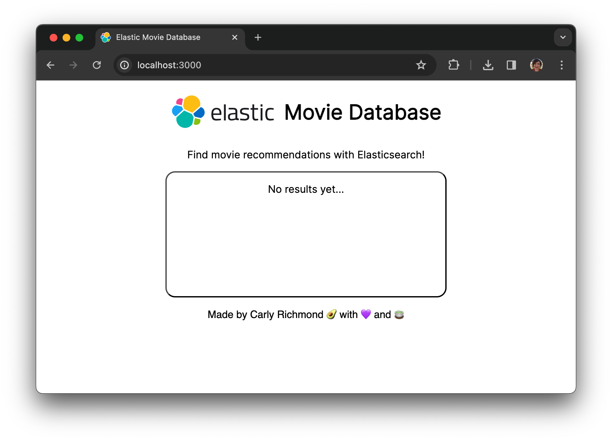
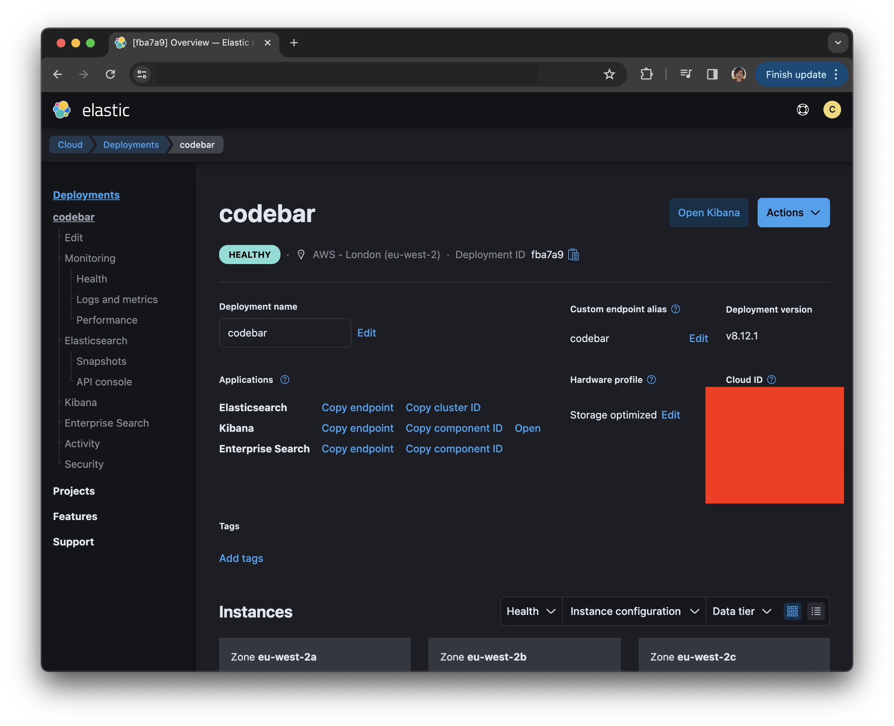
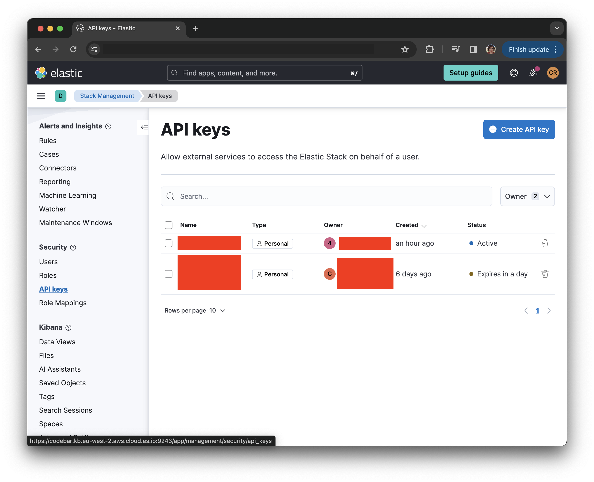
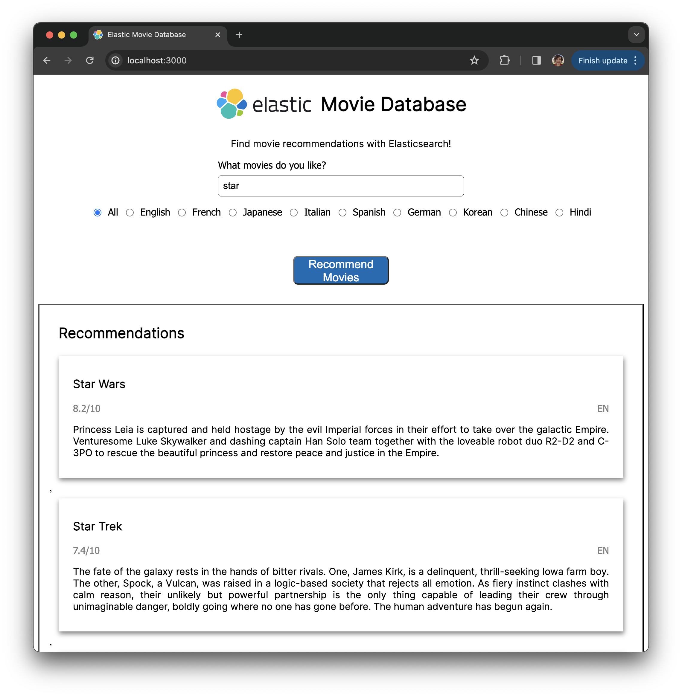

# Lab 3: Initial Web App

In this lab we shall use the [Elasticsearch JavaScript client](https://www.elastic.co/guide/en/elasticsearch/client/javascript-api/current/index.html) to query our index and return matching documents.

The initial skeleton application is page with a title and placeholder text:



In this section we shall add controls for users to input terms, and then use their inputs to return relevant documents from our Elasticsearch cluster.

## Steps

1. Initialize our web application by installing and starting the application:

```bash
cd starting-app
npm install
npm run start
```

Opening `http://localhost:3000` in your favourite browser should present you with the initial application similar to the above screenshot.

2. Add a new section to `index.html` containing a text box and list of radio buttons, replacing the `<div class="input-controls">` element: 

```html
<div class="input-controls">
    <div id="search-bar">
        <label for="query-input">What movies do you like?</label>
        <input type="text" id="subject-input" placeholder="Movies like Amelie" minlength="2" required>
    </div>
          
    <div id="language-options">
        <input type="radio" id="all-languages" name="language" value="all" checked>
        <label for="all-languages">All</label>

        <input type="radio" id="en" name="language" value="en">
        <label for="en">English</label>

        <input type="radio" id="fr" name="language" value="fr">
        <label for="fr">French</label>

        <input type="radio" id="ja" name="language" value="ja">
        <label for="ja">Japanese</label>
              
        <input type="radio" id="it" name="language" value="it">
        <label for="it">Italian</label>
              
        <input type="radio" id="es" name="language" value="es">
        <label for="es">Spanish</label>
              
        <input type="radio" id="de" name="language" value="de">
        <label for="de">German</label>
              
        <input type="radio" id="ko" name="language" value="ko">
        <label for="ko">Korean</label>
              
        <input type="radio" id="cn" name="language" value="cn">
        <label for="cn">Chinese</label>
              
        <input type="radio" id="hi" name="language" value="hi">
        <label for="hi">Hindi</label>
    </div>

    <button>Recommend Movies</button>

</div>
```

3. Insert the below function `getRecommendations()` to wire the button submit event to a function that gets our movie recommendations:

```js
<button onclick="getRecommendations()">Recommend Movies</button>
```

4. Stop our running web app in the terminal using `Command + C` on Mac or `Ctrl + C` on Windows.

5. Install Elasticsearch JavaScript client:

```bash
npm install @elastic/elasticsearch
```

6. Add environment variables `ELASTIC_CLOUD_ID` and `ELASTIC_API_KEY` to your console using the credentials of your cluster (provided by the facilitator for the live session):

Linux/ Mac:
```bash
export ELASTIC_CLOUD_ID=MY_CLOUD_ID
export ELASTIC_API_KEY=MY-API-KEY
```

Windows:
```cmd
set ELASTIC_CLOUD_ID=MY_CLOUD_ID
set ELASTIC_API_KEY=MY-API-KEY
```

If you are using your own cluster the cloud ID is available in the Cloud management cluster:



To create an API Key use the *Create API key* feature under *Stack Management:



7. In `elasticsearch.js` add the below details to establish a client connection using your defined environment variables, and the index you used previously in place of `movies-carly-richmond`:

```js
const cloudID = process.env.ELASTIC_CLOUD_ID;
const apiKey = process.env.ELASTIC_API_KEY;
const index = "movies-carly-richmond";

const client = new elasticsearch.Client({
  cloud: { id: cloudID },
  auth: { apiKey: apiKey },
});
```

8. Add new endpoint `/recommendations` to our Express.js server in `server.js` to get results from Elasticsearch matching our user query:

```js
app.get("/recommendations", async (req, res) => {
  const titleQuery = req.query.query ? decodeURIComponent(req.query.query): '';
  const language = req.query.language !== 'all' ? decodeURIComponent(req.query.language): '';

  let recommendations = [];

  try {
    const response = await getRecommendations(titleQuery, language);
    recommendations = response.hits?.hits.map((hit) => {
      return hit._source;
    });
    
  } catch(e) {
    console.log(e);
  }

  res.send(recommendations);
});
```

9. Add an implementation for function `getRecommendations` to helper `elasticsearch.js` to query Elasticsearch using the query and language options send from the server:

```js
async function getRecommendations(titleQuery, language) {
  if (!client) {
    return;
  }

  const query = {
    index: index,
    query: {
      bool: {
        must: [
          {
            match: {
              title: titleQuery,
            },
          },
        ],
      },
    },
  };

  if (language) {
    query.query.bool.must.push({ match: { original_language: language } });
  }

  return client.search(query);
}
```

10. Amend function `getRecommendations` in `index.js` to add the results to HTML element `.results-container`:

```js
async function getRecommendations() {
  const titleQuery = document.getElementById('query-input').value;
  const language = document.querySelector('input[name="language"]:checked').value;

  // Add loading message
  const placeholderElement = document.getElementById('no-results-message');
  placeholderElement.innerText = 'Getting recommendations...';

  recommendations = [];

  try {
    // Need to encode title query as special characters like spaces is possible
    const encodedTitleQuery = encodeURIComponent(titleQuery);
    
    const response = await fetch(
      `http://localhost:3000/recommendations?query=${encodedTitleQuery}&language=${language}`
    );

    recommendations = await response.json();

    const resultsElement = document.getElementById('results-container');
    resultsElement.innerHTML = recommendations.map((movie) => {
        return `<div class="movie-container">
                    <h3 class="movie-title">${movie.title}</h3>
                    <div class="movie-metadata">
                        <span>${movie.vote_average}/10</span>
                        <span>${movie.original_language.toUpperCase()}</span>
                    </div>
                    <p class="movie-overview">${movie.overview}</p>
                </div>`;
    });

  } catch (error) {
    console.log('Unable to get recommendations');
    placeholderElement.innerText = 'No recommendations available';
  } 
}
```

## Expected Result

Once you restart the server using `npm run start`, if all has gone well we shall have a web application that returns movie results:

