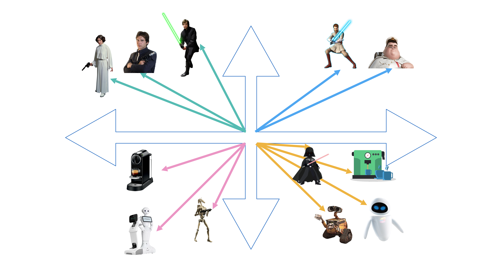
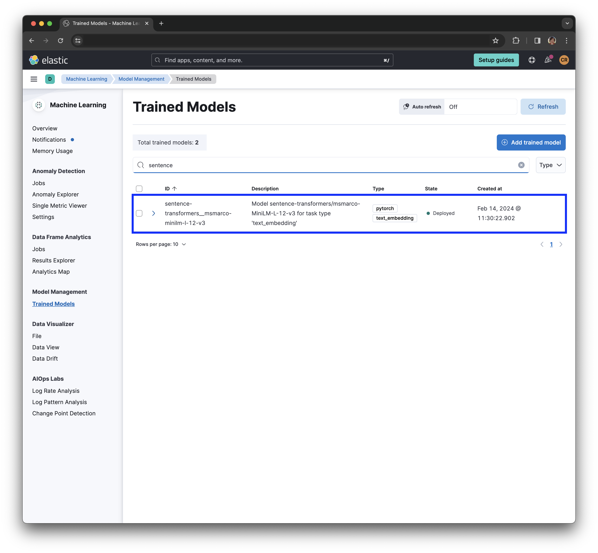

# Lab 4: Generate Vector Embeddings

Following our success in building a simple text search based web application, we shall generate vectors for the movie documents in our cluster.

## What is a vector?

Remembering back to mathematics, a [vector](https://en.wikipedia.org/wiki/Vector_(mathematics_and_physics)) is a geometric object that has length and a direction. Often they are comprised of multiple dimensions, with a numerical representation of each dimension:

```
[these, are, not, the, droid, you, look, for, no, i, am, father]
[1,   2,   1,   1,   1,   1,   1,   1,   0,   0,   0,   0]
```

All documents in our index, when converted into a vector representation, form a space where we can compare the proximity of a give query (also converted to a vector) to the documents in our vector space:



Vector search is the fundamental algorithm that underpins semantic search, which you will have seen in search engines where you ask questions and they return relevant results whose keywords may not exactly match. 

*kNN, or k-Nearest Neighbour* search, compares the embedded query with the documents in the vector space and returns the documents closest to the query through [Euclidean distance](https://en.wikipedia.org/wiki/Euclidean_distance):


In this lab, we shall make use of the transformer model [`sentence-transformers/
msmarco-MiniLM-L-12-v3`](https://huggingface.co/sentence-transformers/msmarco-MiniLM-L-12-v3) uploaded from HuggingFace to our Elastic cluster to generate vectors for our movie documents using an [Ingest pipeline](https://www.elastic.co/guide/en/elasticsearch/reference/current/ingest.html). The alternative approach to generate vectors in our application and send to Elasticsearch for `kNN` search are not covered here, but can be done as [this example highlights](https://www.elastic.co/search-labs/tutorials/search-tutorial/vector-search/generate-embeddings).

## Steps

1. Check that we have a trained model deployed in Elastic by navigating to the *Stack Management > Machine Learning* screen:



2. Navigate to the *Dev Tools * console, and check that a ingest pipeline named `enrich-movies-with-vectors` is present:

```json
GET _ingest/pipeline/enrich-movies-with-vectors
```

3. Using the *Dev Tools* console, create a new index  `vector-movies-<your-first-name>-<your-last-name>` to contain the enriched movies, specifying the `text_embedding` field that will include our resulting vector. For example, the facilitator's index is named `vector-movies-carly-richmond`:

```json
PUT vector-movies-carly-richmond
{
  "mappings": {
    "properties": {
      "embedding": {
        "type": "dense_vector",
        "dims": 384
      }
    }
  }
}
```

4. Reindex our movie data into the new index using `vector-movies-<your-first-name>-<your-last-name>` using the ingest pipeline `enrich-movies-with-vectors`. 

```json
POST _reindex?slices=5&refresh
{
  "source": {
    "index": "movies-carly-richmond"
  },
  "dest": {
    "index": "vector-movies-carly-richmond",
    "pipeline": "enrich-movies-with-vectors"
  }
}
```

If you are finding that the request is timing out or returning with failures, try limiting the reindex operation to just movies with *cold* in the title to reduce the number of documents:

```json
POST _reindex
{
  "source": {
    "index": "movies-carly-richmond",
    "query": {
      "match": {
        "title": "cold"
      }
    }
  },
  "dest": {
    "index": "vector-movies-carly-richmond",
    "pipeline": "enrich-movies-with-vectors"
  }
}
```

5. Check index `vector-movies-<your-first-name>-<your-last-name>` contains documents including field `embedding`:

```json
GET vector-movies-carly-richmond/_search
```

6. Investigate the index mapping and compare to the original index `movies-<your-first-name>-<your-last-name>`. What is the data type of field `embedding`?

```json
GET vector-movies-carly-richmond/_mapping

GET movies-carly-richmond/_search
```

## Expected Result

If all goes well you will have a new index `vector-movies-<your-first-name>-<your-last-name>` containing a set of movies enriched with a dense vector field similar to the below:

```json
{
  "_index": "vector-movies-carly-richmond",
  "_id": "HDJff40BMj9C_ao6YmAM",
  "_score": 0.59750485,
  "_ignored": [
    "overview.keyword"
  ],
  "_source": {
    "overview": "HA Yoon-ju becomes the newest member to a unit within the Korean Police Forces Special Crime Department that specializes in surveillance activities on high profile criminals. She teams up with HWANG Sang-Jun, the veteran leader of the unit, and tries to track down James who is the cold-hearted leader of an armed criminal organization.",
    "original_language": "ko",
    "vote_average": 7.4,
    "id": 7593,
    "embedding": [
          -0.07696302980184555,
          0.32373741269111633,
          ...
        ],
    "model_id": "sentence-transformers__msmarco-minilm-l-12-v3",
    "title": "Cold Eyes",
    "vote_count": 107
  }
}
```