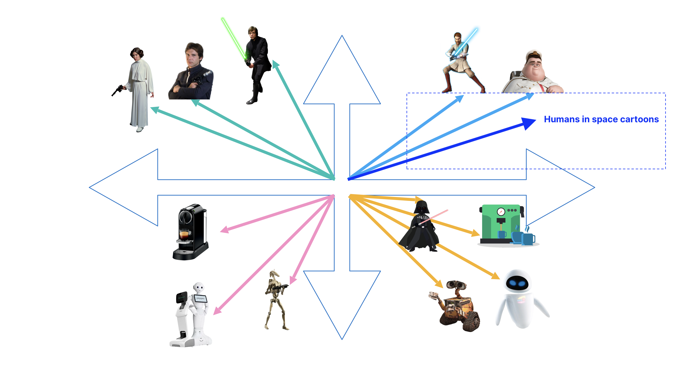
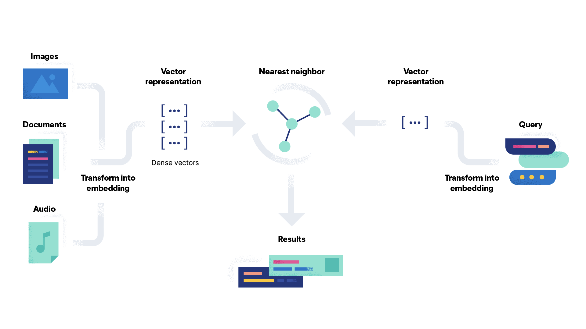

# Lab 5: Semantic Search vs Lexical Search

Now we have enriched our movie data with vectors, it's time to compare traditional lexical search with vector search and see what kinds of queries they accept. For this lab, please ensure you have completed the [data ingestion](./1-data-ingestion), [vector embedding generation](./4-vector-embeddings) and [text search](./2-text-search) modules as a minimum.

## What is Semantic Search?

[Semantic search](https://www.elastic.co/guide/en/elasticsearch/reference/current/semantic-search.html) is an approach that helps you find data based on the contextual meaning. Unlike [lexical search discussed previously in lab 2](./2-text-search), it finds documents based on intent using [vector search to find documents close to the query within the vector space](./4-vector-embeddings).



Vector search is the fundamental algorithm that underpins semantic search, which you will have seen in search engines where you ask questions and they return relevant results whose keywords may not exactly match. 

*kNN, or k-Nearest Neighbour* search, compares the embedded query with the documents in the vector space and returns the documents closest to the query through [Euclidean distance](https://en.wikipedia.org/wiki/Euclidean_distance):



## Steps

*Please ensure you use the indices `movies-<your-first-name>-<your-last-name>` and `vector-movies-<your-first-name>-<your-last-name>`for the below queries. The example queries make use of the facilitators indices `movies-carly-richmond` and `vector-movies-carly-richmond`.*

1. Perform a simple [match query](https://www.elastic.co/guide/en/elasticsearch/reference/current/query-dsl-match-query.html) for `Films to make me laugh`. Look at the first few results and try to find the terms that match. 

```json
GET movies-carly-richmond/_search
{
  "query": {
    "match": {
      "overview": "Films to make me laugh"
    }
  }
}
```

2. Use a [kNN query](https://www.elastic.co/guide/en/elasticsearch/reference/8.12/query-dsl-knn-query.html) to find the 10 closest results to the query `Films to make me laugh` evaluating 100 candidates per shard:

```json
GET vector-movies-carly-richmond/_search
{
  "knn": {
    "field": "embedding",
    "k": 10,
    "num_candidates": 100,
    "query_vector_builder": {
      "text_embedding": { 
        "model_id": "sentence-transformers__msmarco-minilm-l-12-v3", 
        "model_text": "Films to make me laugh" 
      }
    }
  }
}
```

4. Change the above query to evaluate *1000*, *10000* and *100000* candidates: 

```json
// 1000 candidates
GET vector-movies-carly-richmond/_search
{
  "knn": {
    "field": "text_embedding.predicted_value",
    "k": 10,
    "num_candidates": 1000,
    "query_vector_builder": {
      "text_embedding": { 
        "model_id": "sentence-transformers__msmarco-minilm-l-12-v3", 
        "model_text": "Films to make me laugh" 
      }
    }
  }
}

// 10000 candidates
GET vector-movies-carly-richmond/_search
{
  "knn": {
    "field": "text_embedding.predicted_value",
    "k": 10,
    "num_candidates": 10000,
    "query_vector_builder": {
      "text_embedding": { 
        "model_id": "sentence-transformers__msmarco-minilm-l-12-v3", 
        "model_text": "Films to make me laugh" 
      }
    }
  }
}

// 100000 candidates
GET vector-movies-carly-richmond/_search
{
  "knn": {
    "field": "text_embedding.predicted_value",
    "k": 10,
    "num_candidates": 100000,
    "query_vector_builder": {
      "text_embedding": { 
        "model_id": "sentence-transformers__msmarco-minilm-l-12-v3", 
        "model_text": "Films to make me laugh" 
      }
    }
  }
}
```

What differences do you notice in terms of execution time and results?

## Expected Result

Comparing the lexical and vector search queries, we see that the results of the vector search return comedy films that may not contain the term *laugh*, however the keyword search gives us results that either contain *laugh* or give us unexpected results swayed by the other terms in the query.

In terms of the number of candidates, we see that the results returned are different as we are evaluating more documents. The more candidates we compare, the longer the query takes to return: 
  
| `num_candidates` | Time Taken (ms) |
| ---------------- | --------------- |
| 100              | 5               |
| 1000             | 8               |
| 10000            | 16              |
| 100000           | error*          |

\* **[num_candidates] cannot exceed [10000]**: the number of nearest neighbor candidates to consider per shard cannot exceed 10,000, [as per the documentation](https://www.elastic.co/guide/en/elasticsearch/reference/current/knn-search-api.html)