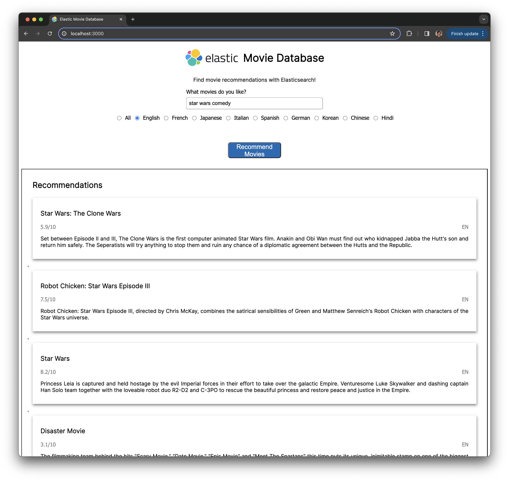

# Lab 6: Hybrid Search

Many people think that semantic search eliminates the need for keyword search. The reality is for exact match use cases, lexical search remains useful as it has lower performance overhead and improved accuracy in those cases compared to semantic search. While in this stage of search transition, we often need to have our applications support both query types.

In this final lab we'll explore how to combine lexical and semantic search, and add it to our movie database application. Note you will need to complete all prior labs up to this point.

## Steps

### Elasticsearch DevTool Queries

1. Using the Elastic DevTools, let's build a combined query using the traditional lexical and modern vector queries we've used in our prior labs:

```json
GET vector-movies-carly-richmond/_search
{
    "query": {
        "match": {
            "title": "cold"
        }
    },
    "knn": {
        "field": "embedding",
        "k": 10,
        "num_candidates": 1000,
        "query_vector_builder": {
            "text_embedding": { 
                "model_id": "sentence-transformers__msmarco-minilm-l-12-v3", 
                "model_text": "Films to make me laugh" 
            }
        }
    }
}
```

Can you figure out which result comes from which query?

2. Let's tweak the boosting to prioritize our `kNN` query over the keyword search by adding a boost of `2` to the vector query and `0.2` to the lexical query:

```json
GET vector-movies-carly-richmond/_search
{
    "query": {
        "match": {
            "title": {
              "query" : "cold",
              "boost": 0.2
            }
        }
    },
    "knn": {
        "field": "embedding",
        "k": 10,
        "num_candidates": 1000,
        "query_vector_builder": {
            "text_embedding": { 
                "model_id": "sentence-transformers__msmarco-minilm-l-12-v3", 
                "model_text": "Films to make me laugh" 
            }
        },
        "boost": 2
    }
}
```

How does this impact our results?

3. Update the boosting factor of our vector query to `10`.:

```json
GET vector-movies-carly-richmond/_search
{
    "query": {
        "match": {
            "title": {
              "query" : "cold",
              "boost": 0.2
            }
        }
    },
    "knn": {
        "field": "embedding",
        "k": 10,
        "num_candidates": 1000,
        "query_vector_builder": {
            "text_embedding": { 
                "model_id": "sentence-transformers__msmarco-minilm-l-12-v3", 
                "model_text": "Films to make me laugh" 
            }
        },
        "boost": 10
    }
}
```

Do we receive the same results?

4. Try using Reciprocal Rank Fusion, or RRF, to blend the results together:

```json
GET vector-movies-carly-richmond/_search
{
    "query": {
        "match": {
            "title": {
              "query" : "cold"
            }
        }
    },
    "knn": {
        "field": "embedding",
        "k": 10,
        "num_candidates": 1000,
        "query_vector_builder": {
            "text_embedding": { 
                "model_id": "sentence-transformers__msmarco-minilm-l-12-v3", 
                "model_text": "Films to make me laugh" 
            }
        }
    },
    "rank": {
      "rrf": {
      }
    }
}
```

How do our results compare to the manual boosting approach discussed previously?

### Web Application with Elasticsearch Client

5. Going back to our web application, amend the query in `elasticsearch.js` to use a hybrid vector and lexical query by changing the index and client query code to include the `knn` and `rank` options used in the prior hybrid query:

```js
const index = 'vector-movies-carly-richmond';

/* Client connection details omitted */
async function getRecommendations(titleQuery, language) {
  if (!client) {
    return;
  }

  const query = {
    index: index,
    query: {
      bool: {
        must: [
          {
            match: {
              title: titleQuery,
            },
          },
        ],
      },
    },
    knn: {
      field: "embedding",
      k: 10,
      num_candidates: 1000,
      query_vector_builder: {
        text_embedding: {
          model_id: "sentence-transformers__msmarco-minilm-l-12-v3",
          model_text: `Films similar to ${titleQuery}`,
        },
      },
    },
    rank: {
      rrf: {},
    },
  };

  if (language) {
    query.query.bool.must.push({ match: { original_language: language } });
  }

  return client.search(query);
}
```

6. Stop our running web app in the terminal using `Command + C` on Mac or `Ctrl + C` on Windows.

7. Restart the application server:

```bash
npm run start
```

## Expected Result

1. Initially when combining the queries without boosting, it becomes clear that the first query is overriding the vector search results as they are more related to coldness than humour. 

2. Initially boosting the `knn` query by a factor of 2 has little effect as we see the queries about coldness are still scoring more highly.

3. Increasing the boosting factor of our `knn` query to `10` results in more humourous suggestions making it into our result set.

4. We see a more even blending of the results, with a comedic result making it into the top 10 range without the need for manual boosting.

5. Adding the query to our web application shows a different set of results, prioritising humourous start wars content over the original films:

