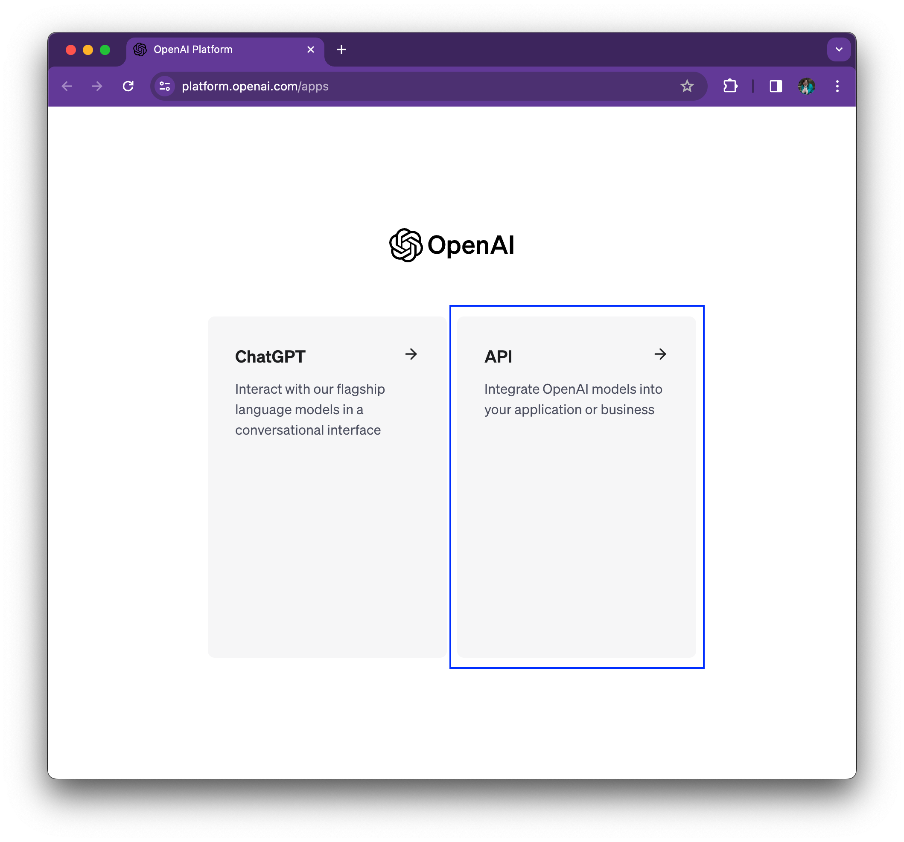
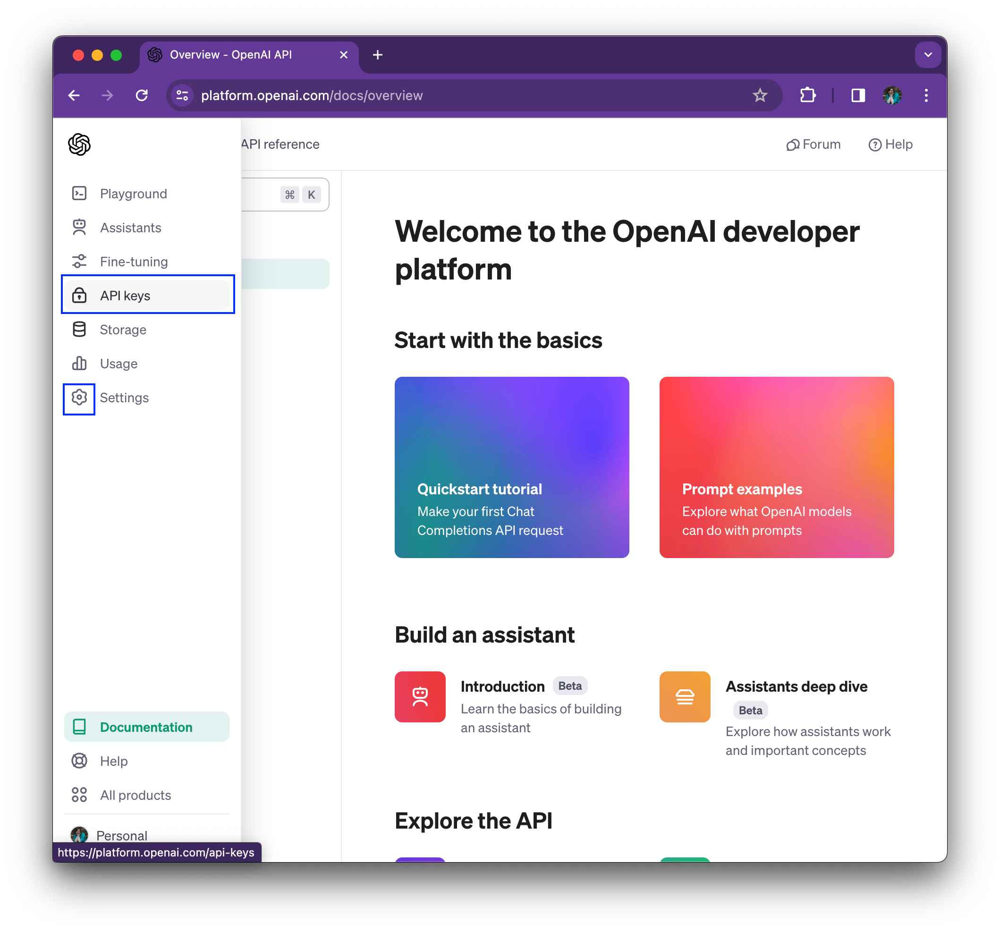
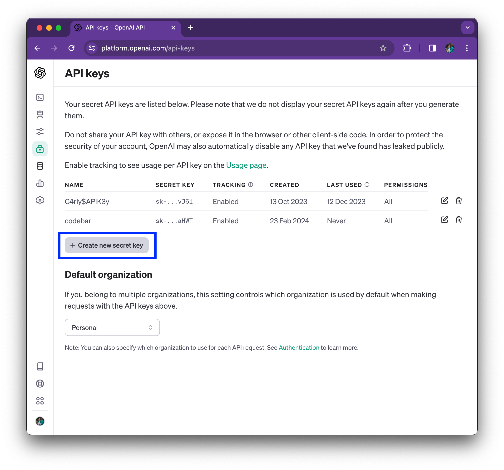
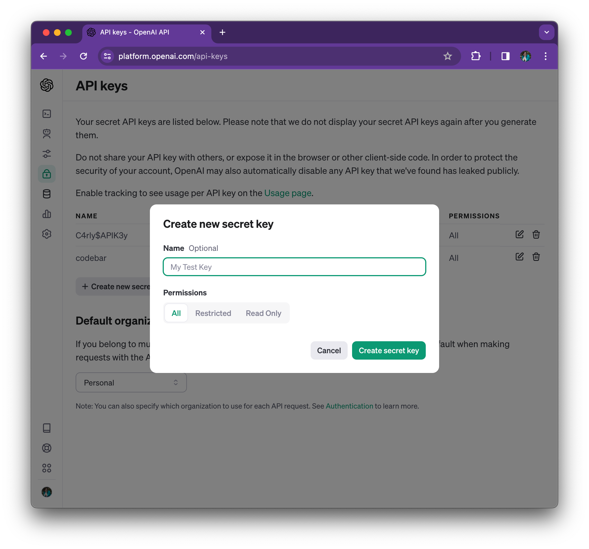
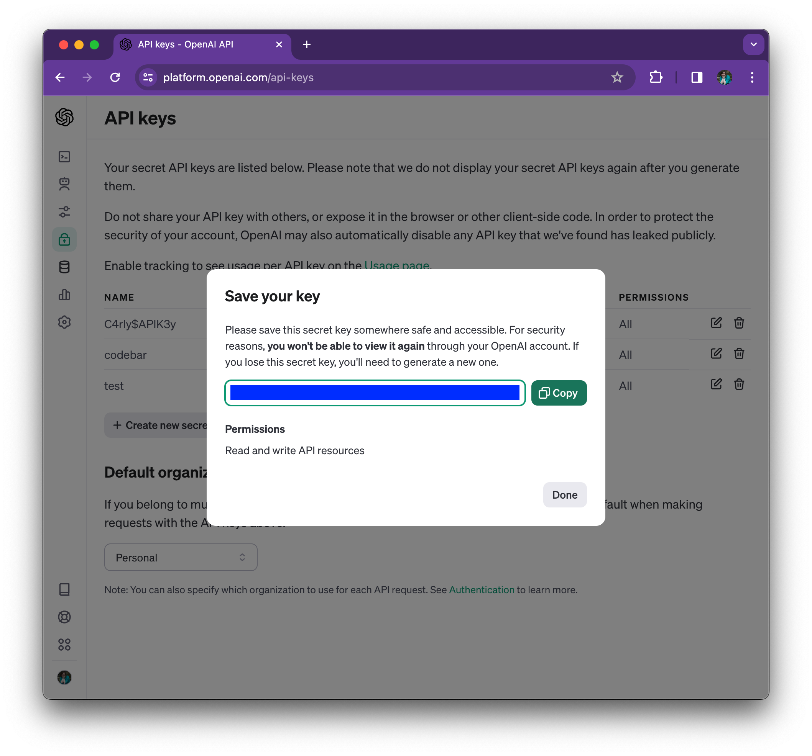

# Extension 7.1: Prerequisites

To complete the RAG application extension, there are additional prerequisites you will need for your application to ensure you can connect to OpenAI.

If you have an existing key feel free to use that, or follow the below steps:

## OpenAI Key Generation Steps

1. Navigate to [https://openai.com/](https://openai.com/).

2. Create an account for OpenAI by going to the [Login option](https://platform.openai.com/login?launch), and filling in the sign up wizard.

3. Once signed in, select the API option (not ChatGPT):

4. Hover over the *Settings* cog and select the *API keys* option:

5. Select the *+ Create new secret key* button:

6. Add a name for your key:

7. Copy your key and put it somewhere safe to use in the [next lab](./7.2-langchain-integration.md):

