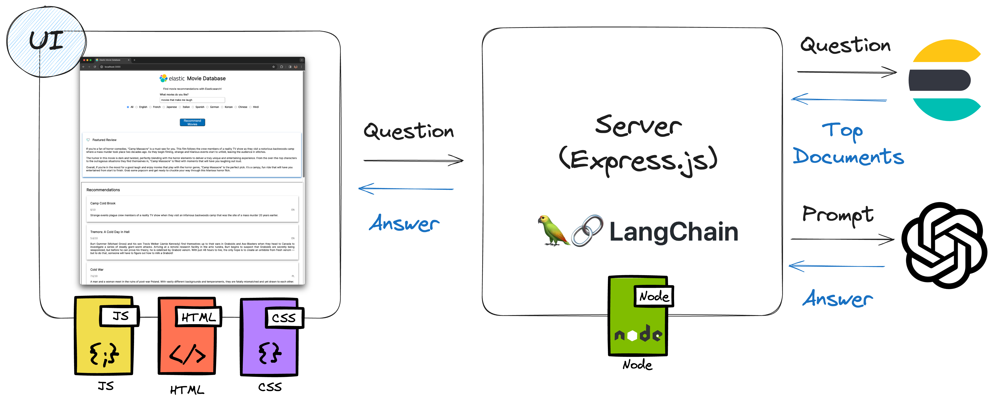

# Lab 7: Adding RAG Capabilities using Langchain and OpenAI

In this extension task, for which the code will be walked through by the facilitator, we shall be adding an LLM generated movie review to our application.

This will change the architecture of our application from a 3 tier application to a RAG, or Retrieval Augmented Generation architecture where our documents are used to generate a response from an LLM. As shown below, we our documents from Elasticsearch to OpenAI via a library known as Langchain:



*Note: this exercise makes use of the Elasticsearch client and Langchain. It is also possible to use the `ElasticVectorStore` to build a retriever with Langchain, but this approach is out of the scope of this course.

## Steps

1. Install Langchain dependencies:

```bash
npm install langchain
npm install @langchain/core/prompts
npm install @langchain/openai
```

2. Add the extra imports at the top of `elasticsearch.js`:

```js
const elasticsearch = require("@elastic/elasticsearch");

const openai = require("@langchain/openai");
const prompts = require("@langchain/core/prompts");
```

3. Amend the Elasticsearch client connectivity logic to use Langchain and OpenAI:

```js
const client = new elasticsearch.Client({
  cloud: { id: cloudID },
  auth: { apiKey: apiKey },
});

const chatModel = new openai.ChatOpenAI({
  openAIApiKey: process.env.OPENAI_API_KEY,
  temperature: 0.9,
});
```

3. Add environment variable `OPENAI_API_KEY` to your console using the key generated from your OpenAI account as per the prerequisites:

Linux/ Mac:
```bash
export OPENAI_API_KEY=MY-LLM-API-KEY
```

Windows:
```cmd
set OPENAI_API_KEY=MY-LLM-API-KEY
```

4. Extract your hybrid query from [lab 6](../6-hybrid-search-web-app) to a new method `getDocumentsForQuery`:

```
async function getDocumentsForQuery(titleQuery, language) {
  const query = {
    index: index,
    query: {
      bool: {
        must: [
          {
            match: {
              title: titleQuery,
            },
          },
        ],
      },
    },
    knn: {
      field: "embedding",
      k: 10,
      num_candidates: 1000,
      query_vector_builder: {
        text_embedding: {
          model_id: "sentence-transformers__msmarco-minilm-l-12-v3",
          model_text: `Films similar to ${titleQuery}`,
        },
      },
    },
    rank: {
      rrf: {},
    },
  };

  if (language) {
    query.query.bool.must.push({ match: { original_language: language } });
  }

  return client.search(query);
}
```

5. Rewrite our `getRecommendations` function to get our documents from Elasticsearch and pass them to our LLM to generate a response:

```js
async function getRecommendations(titleQuery, language) {
  // Get documents from Elasticsearch
  const documents = await getDocumentsForQuery(titleQuery, language);

  // Create prompt template
  const template =
    "Create a movie review containing '${titleQuery}' of the following movie synopsis: {context}";

  if (language) {
    template = template + " in language {language}";
  }

  const promptTemplate = prompts.PromptTemplate.fromTemplate(template);

  // Format prompt with parameters and documents as context
  const formattedPrompt = await promptTemplate.format({
    titleQuery: titleQuery,
    language: language,
    context: documents.hits.hits[0]._source.overview,
  });

  // Get generated response
  const messages = await chatModel.invoke(formattedPrompt);

  return { featuredReview: messages.content, movies: documents };
}
```

6. Amend the `index.html` to include the section for our featured review generated from our top document, which should appear above the `results-container` element from prior exercises:

```html
<div id="featured-container">
  <div class="featured-heading">
    
    <h3 class="movie-title">Featured Review</h3>
  </div>
  <p id="review-content">No films featured</p>
</div>

<div id="results-container">
  <p id="no-results-message">No recommendations yet...</p>
</div>
```

7. Stop our running web app in the terminal using `Command + C` on Mac or `Ctrl + C` on Windows.

8. Restart the application server:

```bash
npm run start
```

## Expected Result

An exciting movie synopsis combining the top results is returned, alongside the relevant documents when we initiate a search:

